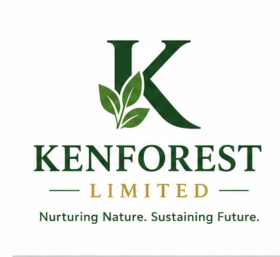

<div align="center">



# Kenforest Limited

**Nurturing Nature. Sustaining Future.**

Official website for Kenforest Limited — a Kenya-based fresh produce grower, processor and exporter. We source, pack and export premium East African avocados, mangoes, passion fruit and macadamia nuts, alongside cold-pressed avocado oil and expert agronomy consultation, to buyers across Europe, the Middle East and Asia.

[](https://nodejs.org)
[](https://www.typescriptlang.org)
[](https://react.dev)
[](https://tailwindcss.com)
[](https://vite.dev)
[](./LICENSE)

</div>

---

## Table of Contents

- [Overview](#overview)
- [Pages](#pages)
- [Tech Stack](#tech-stack)
- [Prerequisites](#prerequisites)
- [Getting Started](#getting-started)
- [Available Scripts](#available-scripts)
- [Project Structure](#project-structure)
- [Deployment](#deployment)
- [Certifications](#certifications)
- [Contact](#contact)
- [License](#license)

---

## Overview

This is the official marketing and enquiry website for **Kenforest Limited**. It is a server-side rendered (SSR) application built with TanStack Start, React 19 and Tailwind CSS v4. The site showcases Kenforest's export produce portfolio, agronomy consultation services, certifications and market reach, and provides a direct enquiry channel for international buyers.

---

## Pages

| Route | Description |
|---|---|
| `/` | Home — hero, trust stats, products overview, export markets, process timeline, certifications, gallery, testimonial, CTA |
| `/products` | Avocados, mangoes, passion fruit, macadamia specs; cold-pressed avocado oil; private-label offering |
| `/consultation` | Agronomy services, orchard establishment, GlobalG.A.P. readiness, engagement packages, FAQ |
| `/about` | Company story, mission, vision, values, sustainability metrics |
| `/contact` | Head office details, enquiry form with confirmation state |

---

## Tech Stack

| Layer | Technology |
|---|---|
| Framework | [TanStack Start](https://tanstack.com/start) (SSR) |
| Routing | [TanStack Router](https://tanstack.com/router) (file-based) |
| UI | [React 19](https://react.dev) + [Tailwind CSS v4](https://tailwindcss.com) |
| Components | [Radix UI](https://www.radix-ui.com) primitives via [shadcn/ui](https://ui.shadcn.com) |
| Data fetching | [TanStack Query](https://tanstack.com/query) |
| Build tool | [Vite 8](https://vite.dev) |
| Language | TypeScript 5 (strict mode) |
| Linting | ESLint 9 + typescript-eslint |
| Formatting | Prettier |
| Fonts | Playfair Display (display) · Inter (body) via Fontsource |
| Deployment | [Vercel](https://vercel.com) (Nitro vercel preset) |

---

## Prerequisites

| Requirement | Version |
|---|---|
| Node.js | `>= 22.12.0` |
| npm | `>= 9` |

> **Tip:** Use [nvm](https://github.com/nvm-sh/nvm) to manage Node versions:
> ```bash
> nvm install 22 && nvm use 22
> ```

---

## Getting Started

```bash
# 1. Clone the repository
git clone https://github.com/mikemarvel-stack/Kenforest.git
cd Kenforest

# 2. Install dependencies
npm install

# 3. Start the development server
npm run dev
```

Open [http://localhost:3000](http://localhost:3000) in your browser.

---

## Available Scripts

| Script | Description |
|---|---|
| `npm run dev` | Start development server with HMR on port 3000 |
| `npm run build` | Production build (outputs to `.output/`) |
| `npm run build:dev` | Development build |
| `npm run preview` | Preview the production build locally |
| `npm run lint` | Run ESLint across the project |
| `npm run format` | Format all files with Prettier |

---

## Project Structure

```
Kenforest/
├── public/
│   ├── Logo.png              # Brand logo (served at /Logo.png)
│   └── Favicon.png           # Browser favicon
├── src/
│   ├── assets/               # Static images (orchard, packhouse, products, etc.)
│   ├── components/
│   │   ├── site/             # SiteHeader, SiteFooter, PageShell, PageHero
│   │   └── ui/               # Radix/shadcn UI primitives
│   ├── hooks/                # useIsMobile (SSR-safe)
│   ├── lib/                  # cn() utility, error capture, error page renderer
│   ├── routes/               # File-based routes (TanStack Router)
│   │   ├── __root.tsx        # Root layout, fonts, meta tags, error boundary
│   │   ├── index.tsx         # Home page
│   │   ├── products.tsx      # Products page
│   │   ├── consultation.tsx  # Consultation & agronomy page
│   │   ├── about.tsx         # About page
│   │   └── contact.tsx       # Contact page
│   ├── router.tsx            # Router + QueryClient configuration
│   ├── routeTree.gen.ts      # Auto-generated route tree (do not edit)
│   ├── server.ts             # SSR server entry with h3 error handling
│   ├── start.ts              # TanStack Start middleware
│   └── styles.css            # Tailwind v4 theme + design tokens (oklch)
├── .gitignore
├── eslint.config.js
├── tsconfig.json
├── vercel.json               # Vercel deployment configuration
├── vite.config.ts            # Vite + TanStack Start + Nitro (vercel preset)
└── package.json
```

---

## Deployment

The project is configured for deployment on **Vercel** using the Nitro `vercel` preset.

### Deploy to Vercel

1. Push your code to GitHub
2. Go to [vercel.com/new](https://vercel.com/new) and import the repository
3. Vercel will auto-detect settings from `vercel.json` — no manual configuration needed
4. Set **Node.js version** to `22.x` in Project → Settings → General if not auto-detected
5. Click **Deploy**

### Build output

| Path | Contents |
|---|---|
| `.output/public/` | Static assets (served by Vercel CDN) |
| `.output/server/` | SSR function (runs on Vercel Edge/Node runtime) |

### Environment variables

No environment variables are required. The contact form uses a `mailto:` link with no backend dependency.

---

## Certifications

Kenforest operates under the following internationally recognised standards:

| Certification | Description |
|---|---|
| **GlobalG.A.P.** | Good Agricultural Practices — farm-level certified |
| **KEPHIS** | Kenya Plant Health Inspectorate — export registration |
| **HCD** | Horticultural Crops Directorate — licensed exporter |
| **GRASP** | GlobalG.A.P. Risk Assessment on Social Practice |

---

## Contact

| | |
|---|---|
| 📧 Email | [kenforestlimited@gmail.com](mailto:kenforestlimited@gmail.com) |
| 📞 Phone | [+254 711 281 829](tel:+254711281829) |
| 📍 Address | P.O. Box 50729-00232, Nairobi, Kenya |
| 🌐 Website | [www.kenforestlimited.com](https://www.kenforestlimited.com) |
| 🕐 Hours | Mon – Fri · 08:00 – 17:00 EAT |

---

## License

Copyright © 2024–present **Kenforest Limited**. All rights reserved.

This codebase and all associated content are proprietary. Unauthorised copying, modification, distribution or use is strictly prohibited.

See [LICENSE](./LICENSE) for full terms.
